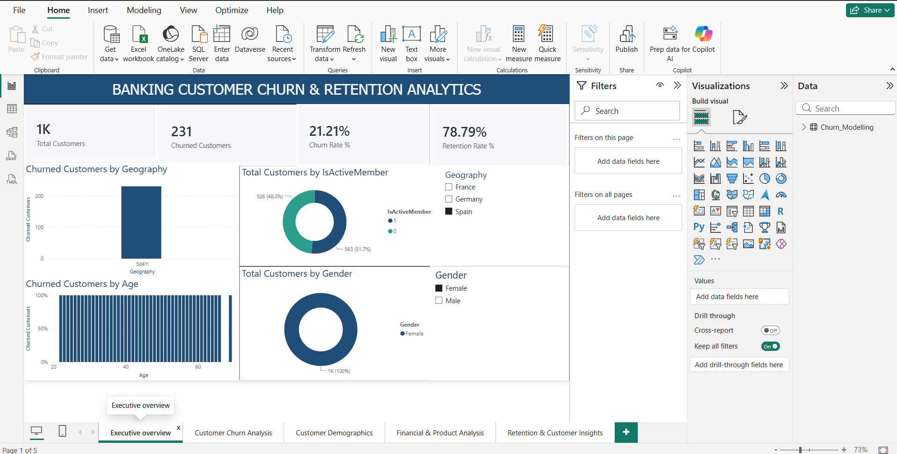
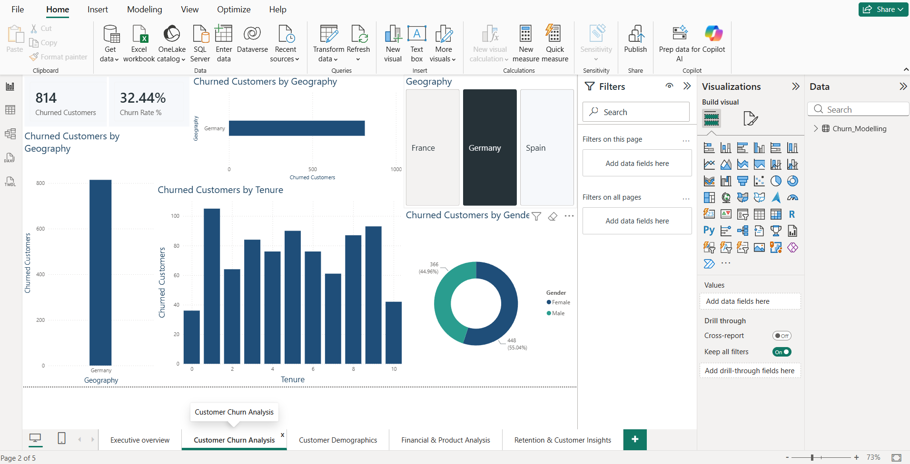
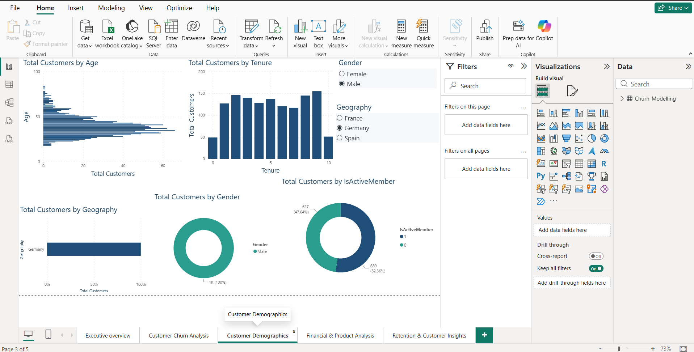
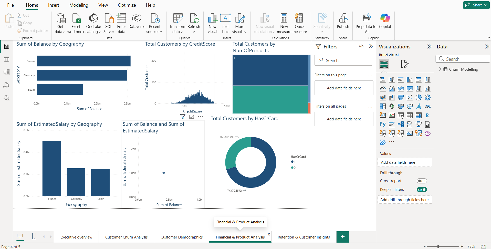
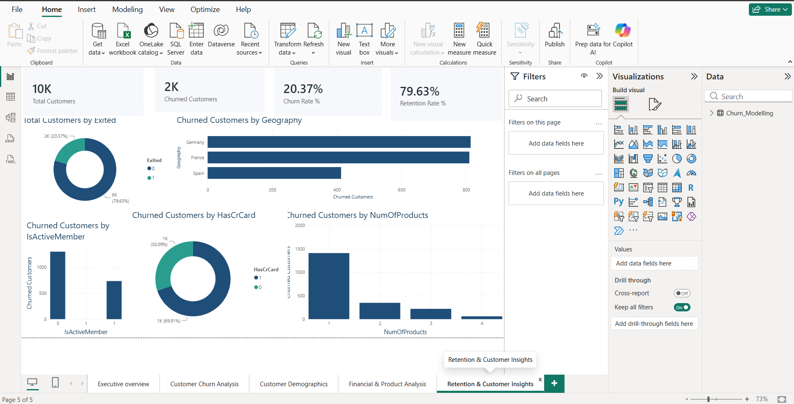

# Banking Customer Churn & Retention Analytics Dashboard

An interactive Power BI dashboard for analyzing banking customer churn, retention, demographics, financial behavior, and product usage.

## Tools Used

- Power BI
- DAX
- Excel / CSV
- Data Visualization

## Dashboard Pages

1. Executive Overview
2. Customer Churn Analysis
3. Customer Demographics
4. Financial & Product Analysis
5. Retention & Customer Insights

## Key Analysis

- Customer Churn & Retention
- Churn by Geography
- Churn by Gender
- Churn by Age
- Churn by Tenure
- Credit Score Analysis
- Product Usage
- Credit Card Ownership
- Active Member Analysis
- Balance & Estimated Salary

## Project Objective

To identify customer churn patterns and generate data-driven insights that can support customer retention strategies.

## 📸 Dashboard Screenshots

### 1. Executive Overview

### 2. Customer Churn Analysis

### 3. Customer Demographics

### 4. Financial & Product Analysis

### 5. Retention & Customer Insights

